# Image and Vision Computing

This repository contains the code for the University of Edinburgh [School of Informatics](http://www.inf.ed.ac.uk) course [Image and Vision Computing](https://www.learn.ed.ac.uk/webapps/blackboard/execute/launcher?type=Course&id=_57835_1).

This course is focused on learning how images are formed given the objects in the three dimensional world, and the basics of how computer vision inverts this process. Students who take this couse will have an excellent understanding of image formation, low-level image analysis, image representation and high-level analysis, as well as their applications.

# Cat-Dog Classification 
The aim of this coursework is to explore the classification of images using a ResNet18 Convolutional Neural Network and a Bag of Visual Words (BoVW) method that uses Support Vector Machines (SVM) on a dataset that contains 1200 224 x 224 images of cats and dogs.

| &nbsp;        | Cats              | &nbsp;| Dogs                      | &nbsp;|
|:-------------:|:-----------------:|:-----:|:-------------------------:|:-----:|
| **SubClass**  | **Breeds**        | **n** | **Breeds**                | **n** |
| 1             | Abyssinian        | 99    | American Bulldog          | 100   |
| 2             | Bengal            | 98    | American Pitbull Terrier  | 100   |
| 3             | Birman            | 100   | Basset Hound              | 100   |
| 4             | Bombay            | 100   | Beagle                    | 100   |
| 5             | British Shorthair | 100   | Boxer                     | 100   |
| 6             | Egyptian Mau      | 92    | Chihuahua                 | 100   |
| 7             | Maine Coon        | 100   | English Cocker Spaniel    | 100   |
| 8             | Persian           | 100   | English Setter            | 100   |
| 9             | Ragdoll           | 98    | German Shorthaired        | 100   |
| 10            | Russian Blue      | 100   | Great Pyrenees            | 100   |
| 11            | Siames            | 100   | Havanese                  | 100   |
| 12            | Sphync            | 100   | Japanese Chin             | 100   |
| ***Total***   | &nbsp;            | 1188  | &nbsp;                    | 1200  |

# The BoVW and ResNet models
We seek to evaluate the performance of two models. The first model is the Bag of Visual Words model, which grabs the keypoints in an image, clusters them using a K-Means clustering algorithm, and then converts this into a histogram representation, which finally outputs a vector representation of the image, the bag of visual words, kind of like a dimensionality reduction:

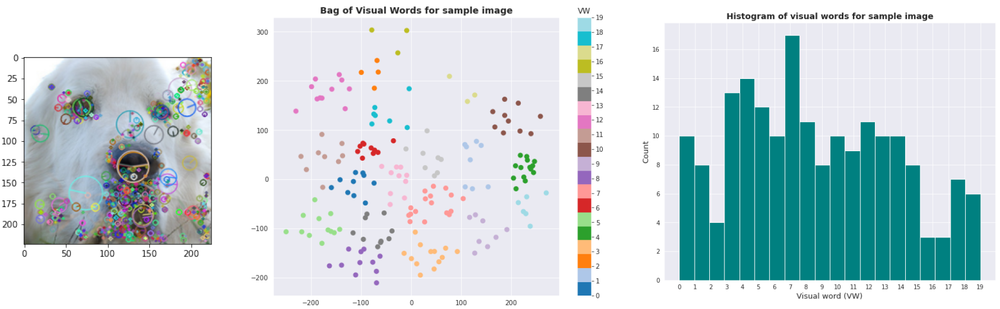

All the histograms corresponding to each image in the dataset is then projected into a a vector space, where a regular linear or non-linear classifier can be applied, in our case we use Support Vector Machines to classify whether an image is a cat or a dog, as follows (the dark points are cats, and the light ones are dogs).

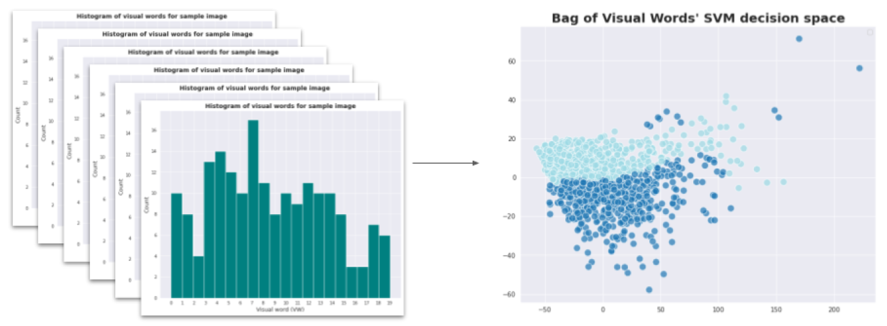

The second model, and following the current state of the art, is a ResNet18 model, which follows the VGG CNN architecture and uses skip connections on top of that to solve the vanishing gradient problem that is present in deep convolutional networks. An illustration of this architecture from [this blog](https://towardsdatascience.com/an-overview-of-resnet-and-its-variants-5281e2f56035) is shown below.

In this study, both models are trained and fine-tuned using a 3-fold cross-validation strategy that provides three training sets and three testing sets. We fine-tune both models on the three training splits, by further dividing these into training and validation splits. The best models from this fine-tuning are then tested on the testing sets. 

Finally, we gradually perturb the testing sets with different types of noises and report the testing accuracy after each perturbation. More on this in the following section and on `report.pdf`.

# A Sneak Peak into some results
Using the best performing models for the ResNet18 architecture and the BoVW, we evaluated the models' performance on testing data using the mean accuracy as the evaluation metric. The average test accuracy for the ResNet18 models was **99%** and for the BoVW models was **81%**.

Finally, to evaluate the models' robustness to noise, we added perturbations to the testing images with different levels of noise.

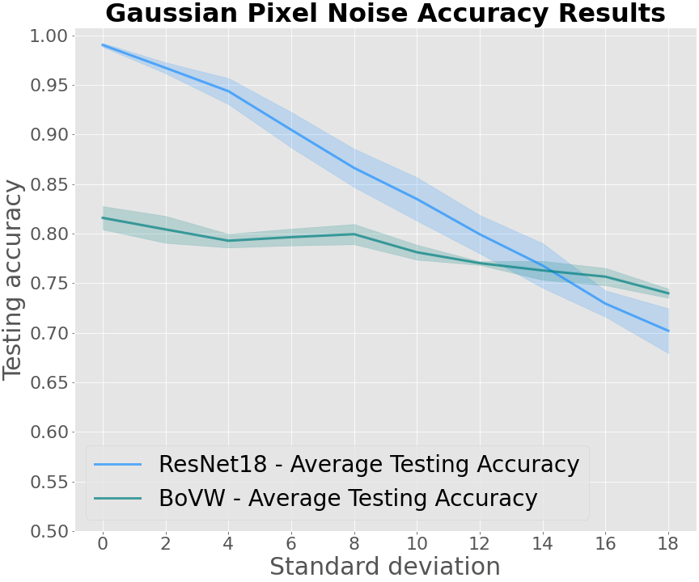
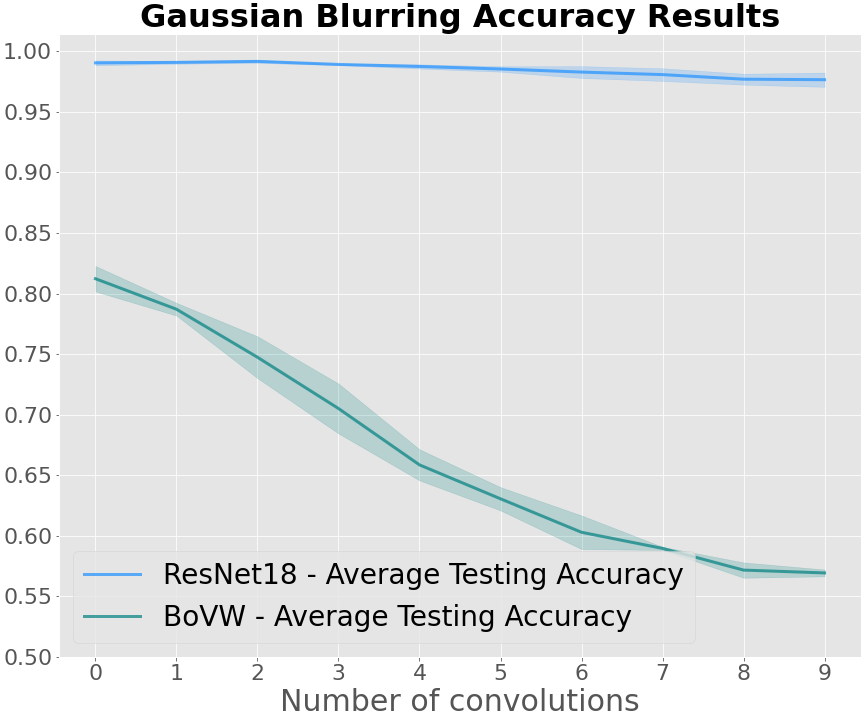
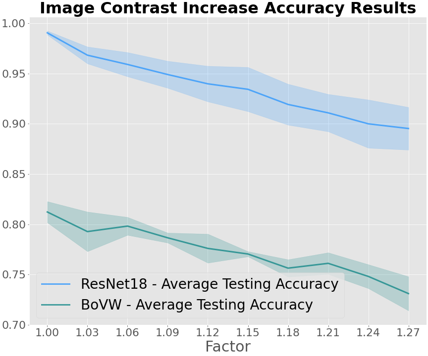

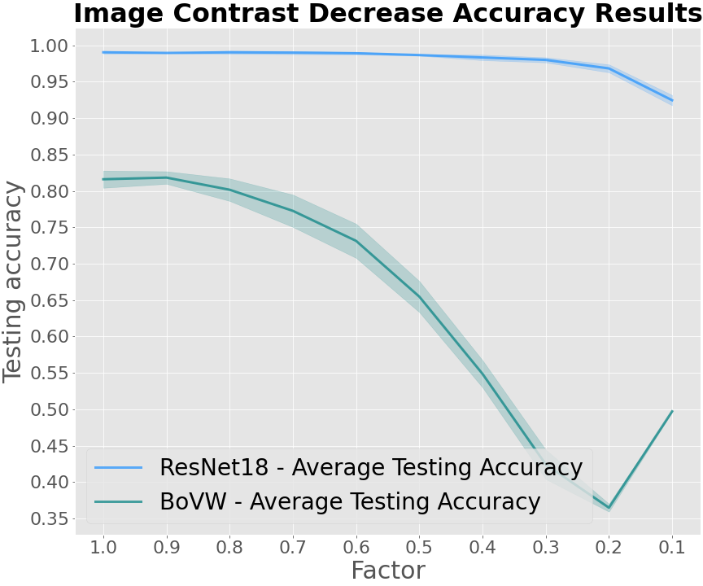
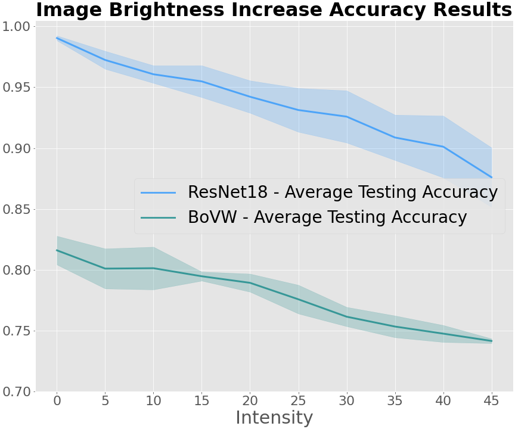
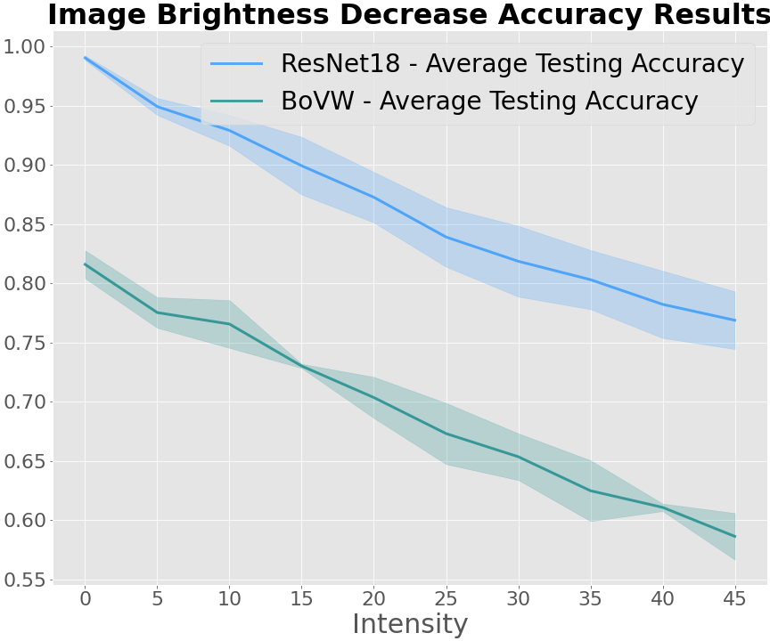

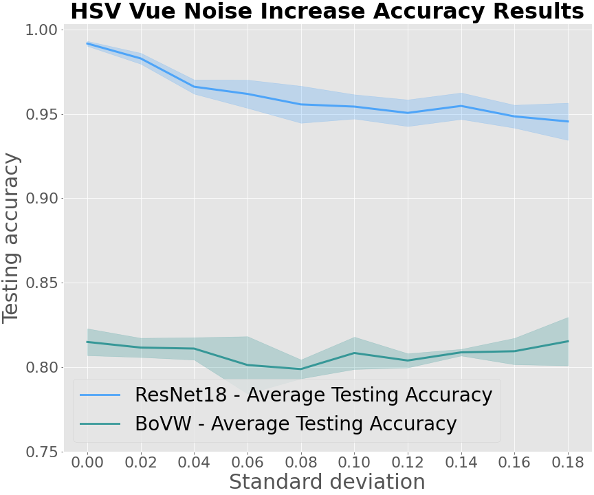
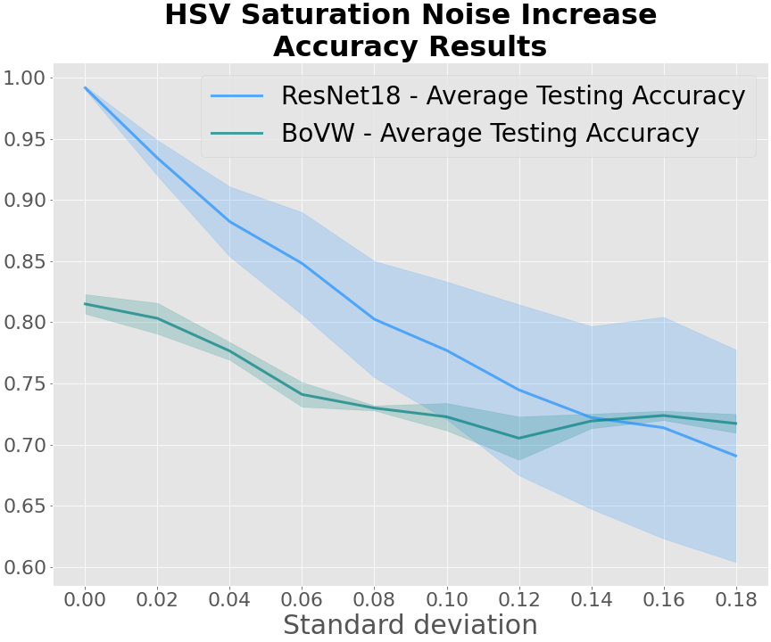
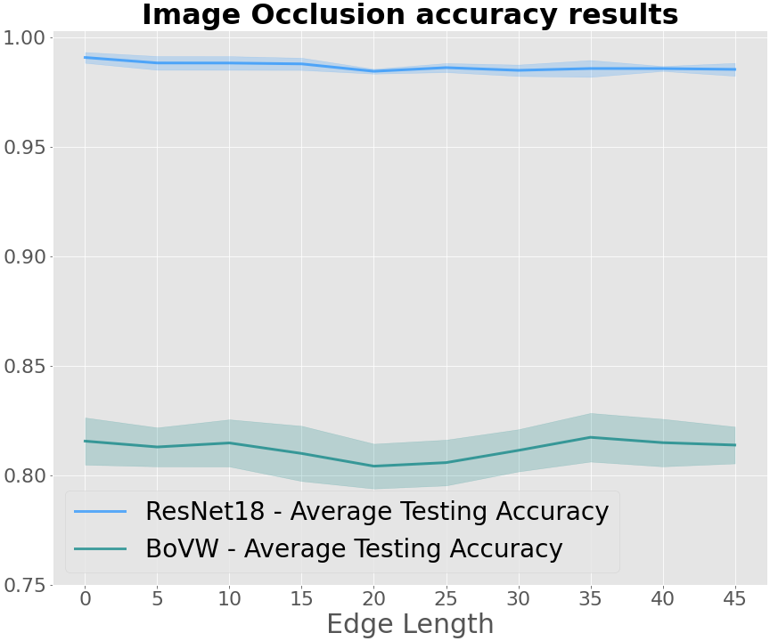

A detailed description of the methods used and the results obtained can be found in `report.pdf` contained within this repository.

